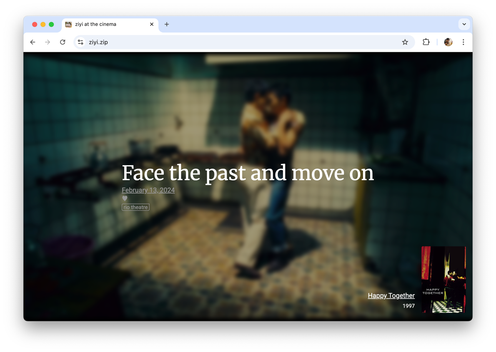

# `ziyi.zip`

this is a web extension and website that i made as an archive of ziyi's letterboxd reviews

ziyi's reviews are just so precious that they must be cherished

## installation

[link-chrome]: https://chromewebstore.google.com/detail/ziyizip/kgjlmncdpdpcmidkkalcdppigdocdnmf "Version published on Chrome Web Store"
[link-firefox]: https://addons.mozilla.org/en-US/firefox/addon/ziyi-zip/ "Version published on Mozilla Add-ons"
[link-github]: https://github.com/braxtonhall/ziyi.zip/releases/latest/ "Latest release on GitHub"

[][link-chrome]
[][link-chrome]

[][link-firefox]
[][link-firefox]

[][link-github]
[][link-github]
